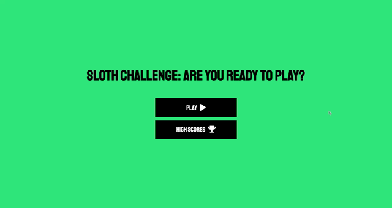

# TimedSlothQuiz

## Description

This project utilizes dynamically updated `HTML` and `CSS` powered by `JavaScript` to create a game/quiz application. <i>The project requirements also stated that a timer was required.  At this time, the timer functionality is still being researched and worked on, so that feature is not turned on.</i>

## Task

The game/quiz application must have a start/play button, which prompts the start of the game/quiz. A player answers the question, and is then presented with another question. When all questions are answered, the game is over, and the player's score is displayed.  The player then has the option to enter their initials and save their score, which will be stored on a leaderboard.

<i>Additionally, a timer is supposed to be included, which gauges how much time a player has remaining before the game ends.  The timer is also supposed to be designed to give a player a time penalty if a question is answered incorrectly.

Currently, a progress bar is displayed as questions are answered, and correct answers are highlighted in green, while incorrect answers are highlighted in red.

The final version of this game/quiz will include a functioning timer as well, but this function is currently still being worked on.</i>

## Usage

This application can be used by anyone who would like to play a fun quiz game about sloths.

## Installation

This project will require a user to have:
* `Git Bash` (Windows), `Terminal` (Mac), or another application for executing commands to/from one's local machine.
* Code editor installed, such as `Visual Studio Code`.
* Version control system, such as `GitHub`, to fork, clone, push, and pull the original repository, and to upload the final project to one's own version control system account.

## Process

* This project began from scratch, and involved creating the following files:
    * Four `HTML` pages:  `index.html`, `game.html`, `end.html`, and `highscores.html`
    * Three `CSS` pages: `style.css`, `game.css`, and `highscores.css`
    * Three `JavaScript` pages: `game.js`, `end.js`, and `highscores.js`

* An outline was sketched out to determine how each of the `HTML` pages would function together with each of the `JavaScript` pages in order to create a smooth-functioning game/quiz application.
    * The player is presented with a start screen that allows them to either play the game or view high scores.
    * Once the player begins the game, the first question appears on screen, with four answers choices from which to select.
    * The game/quiz cycles through a total of five questions, and each answer recorded will either let the player know they were correct/incorrect, as well as the overall score.
    * Once the game/quiz is complete, the player is presented with an end page that displays their score, and provides the player with the opportunity to save their score, play again, or return to the start screen.
    * If the player chooses to save their score, a leaderboard page will be displayed, which will house all scores captured by the player.  This page also presents the player with the option to return to the home screen or clear all scores.

## Link to Deployed Website

https://mkindler.github.io/TimedSlothQuiz/

## Demo of Deployed Website

## Contributing

Please open a New Issue via GitHub for pull requests on this project that includes a description of what you would like to change.

## Acknowledgment

* Trilogy Education Services
* https://www.w3schools.com
* https://www.screencastify.com/
* https://fontawesome.com/
* Book:  <i>JavaScript & JQuery:  Interactive Front-End Web Development</i>, Jon Duckett
* [10 Facts About Sloths](https://www.worldanimalprotection.us/news/10-facts-about-sloths-natures-slowest-animals)